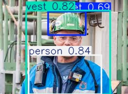

# 1. YOLOv8 PPE Detection

## 1.1 Overview

This project is a real-time PPE (Personal Protective Equipment) detection system built using YOLOv8 for construction-site safety monitoring.

The model detects workers and safety equipment from construction-site images using object detection and bounding-box visualization techniques.

This project was developed to expand my computer vision experience from medical image analysis to practical real-world object detection pipelines.

---

## 1.2 Classes

- helmet
- no-helmet
- person
- vest
- no-vest

---

## 1.3 Tech Stack

- Python
- Ultralytics YOLOv8
- PyTorch
- OpenCV

---

## 1.4 Project Motivation

Previously, I worked on medical computer vision projects including:

- Brain Segmentation
- Lung Classification

To broaden my computer vision portfolio, I additionally developed this YOLOv8-based PPE detection project focusing on:

- object detection
- bounding-box visualization
- real-time inference
- deployment-oriented pipelines

---

## 1.5 Dataset

The project uses a construction-site PPE dataset in YOLO annotation format.

Dataset structure:
```text
dataset/
├── images/
│   ├── train/
│   ├── val/
│   └── test/
└── labels/
    ├── train/
    ├── val/
    └── test/
```
---

## 1.6 Model

- YOLOv8n
- Image Size: 416
- Task: Object Detection

---

## 1.7 Training

python train.py

---

## 1.8 Validation

python val.py

---

## 1.9 Inference

python infer.py --image_path samples/sample.jpg

---

## 1.10 Results

| Metric | Score |
|---|---:|
| mAP50 | 0.875 |
| mAP50-95 | 0.524 |
| Precision | 0.808 |
| Recall | 0.810 |

---

## 1.11 Demo

### Before


### After



---

## 1.12 Project Highlights

- Built an end-to-end object detection pipeline using YOLOv8
- Trained a PPE detection model for construction-site safety monitoring
- Implemented bounding-box visualization with confidence scores
- Developed a reusable inference script for image-based detection
- Evaluated model performance using mAP, precision, and recall metrics
- Structured the project for deployment-oriented workflows

---

## 1.13 Future Improvements

- Improve detection accuracy using YOLOv8s or YOLOv8m
- Increase training epochs and augmentation strategies
- Add real-time webcam inference
- Deploy using Streamlit or ONNX runtime

---

## 1.14 Portfolio Summary

This project demonstrates practical computer vision skills in:

- Object Detection
- Bounding Box Prediction
- Real-time Inference
- YOLO-based Deployment Pipelines

Combined with my previous medical imaging projects, this work expands my experience across segmentation, classification, and detection tasks in computer vision.
=======
# yolov8-ppe-detection
>>>>>>> a1b1529be89f322b21c8323834bf10ca17b698d5
